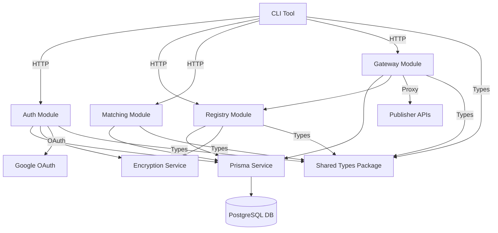

# Future CLI - Low-Level Design (LLD) Architecture Document

**Version:** 1.0  
**Date:** 2026-06-22  
**System:** Future Model Marketplace  

---

## 1. System Overview

### 1.1 Purpose
Future is a model marketplace platform that enables:
- **Publishers** to register AI models with OpenAI-compatible API endpoints
- **End Users** to discover and use models through a CLI interface

The system acts as a gateway between Claude Code CLI and various AI model backends, transparently routing requests through registered model endpoints.

### 1.2 Architecture Style
- **Monorepo Structure** with 3 packages
- **Client-Server Architecture** (CLI ↔ NestJS Backend)
- **Gateway Pattern** (Anthropic ↔ OpenAI translation layer)
- **Event-Driven** OAuth flow with PKCE security

### 1.3 Technology Stack

| Layer | Technology |
|-------|------------|
| Frontend CLI | Node.js, TypeScript, Commander.js, Inquirer |
| Backend API | NestJS, Express, TypeScript |
| Database | PostgreSQL, Prisma ORM |
| Authentication | Google OAuth 2.0, JWT, PKCE |
| API Protocol | OpenAI-compatible REST, Anthropic Messages API |
| Encryption | AES-256-GCM (API key encryption) |
| Documentation | Swagger/OpenAPI |

---

## 2. Component Diagram

```
┌─────────────────────────────────────────────────────────────────┐
│                          FUTURE SYSTEM                          │
├─────────────────────────────────────────────────────────────────┤
│                                                                 │
│  ┌──────────────┐         ┌──────────────────────────────┐     │
│  │              │         │      NESTJS BACKEND         │     │
│  │   CLI TOOL   │         │                              │     │
│  │              │         │  ┌────────────────────────┐  │     │
│  │ ┌──────────┐│         │  │   AUTH MODULE         │  │     │
│  │ │ Commands ││  HTTP    │  │  • Google OAuth       │  │     │
│  │ │  • login ││◄────────►│  │  • JWT Strategy       │  │     │
│  │ │  • ask   ││         │  │  • PKCE Flow          │  │     │
│  │ │  • list  ││         │  └────────────────────────┘  │     │
│  │ │  • use   ││         │                              │     │
│  │ │  • pub   ││         │  ┌────────────────────────┐  │     │
│  │ └──────────┘│         │  │  REGISTRY MODULE      │  │     │
│  │              │         │  │  • Model CRUD         │  │     │
│  │ ┌──────────┐│         │  │  • API Key Encryption │  │     │
│  │ │   Core   ││         │  │  • Publisher Mgmt     │  │     │
│  │ │  • Config││         │  └────────────────────────┘  │     │
│  │ │  • Store ││         │                              │     │
│  │ └──────────┘│         │  ┌────────────────────────┐  │     │
│  │              │         │  │  MATCHING MODULE      │  │     │
│  │              │         │  │  • Keyword Extraction │  │     │
│  │              │         │  │  • Scoring Algorithm │  │     │
│  │              │         │  └────────────────────────┘  │     │
│  │              │         │                              │     │
│  │              │         │  ┌────────────────────────┐  │     │
│  │              │         │  │  GATEWAY MODULE       │  │     │
│  │              │         │  │  • Session Mgmt       │  │     │
│  │              │         │  │  • Request Proxy      │  │     │
│  │              │         │  │  • API Translation    │  │     │
│  │              │         │  └────────────────────────┘  │     │
│  └──────────────┘         └───────────────┬──────────────┘     │
│                                            │                    │
│                                            │                    │
│                                            ▼                    │
│                          ┌─────────────────────────────┐       │
│                          │    POSTGRESQL DATABASE      │       │
│                          │                             │       │
│                          │  • publishers               │       │
│                          │  • models                   │       │
│                          │  • sessions                 │       │
│                          │  • refresh_tokens           │       │
│                          │  • oauth_states             │       │
│                          │  • one_time_codes           │       │
│                          └─────────────────────────────┘       │
│                                                                 │
└─────────────────────────────────────────────────────────────────┘

         External Systems
         ─────────────────
         
    ┌─────────────┐              ┌─────────────────┐
    │   GOOGLE    │              │  PUBLISHER      │
    │   OAUTH     │              │  API ENDPOINTS  │
    │   PROVIDER  │              │  (OpenAI-compat)│
    └─────────────┘              └─────────────────┘
```

---

## 3. Module Structure

### 3.1 Project Structure

```
bhavishya/
├── apps/
│   └── backend/                    # NestJS Backend Application
│       ├── src/
│       │   ├── main.ts             # Entry point (Swagger, CORS, validation)
│       │   ├── app.module.ts       # Root module with throttling, JWT guard
│       │   ├── auth/               # Authentication module
│       │   ├── registry/           # Model registry module
│       │   ├── matching/           # Model matching engine
│       │   ├── gateway/            # API gateway/proxy
│       │   └── common/             # Shared utilities
│       ├── prisma/
│       │   └── schema.prisma       # Database schema
│       └── package.json
│
├── packages/
│   ├── cli/                        # CLI Package (@future/cli)
│   │   ├── src/
│   │   │   ├── index.ts           # CLI entry point
│   │   │   ├── commands/          # Command implementations
│   │   │   └── core/              # Configuration and state management
│   │   └── package.json
│   │
│   └── shared/                     # Shared Types (@future/shared)
│       ├── src/
│       │   ├── models.ts           # Model/publisher types
│       │   ├── auth.ts            # Auth token types
│       │   ├── gateway.ts         # Gateway session types
│       │   ├── anthropic.ts       # Anthropic API types
│       │   ├── openai.ts          # OpenAI API types
│       │   └── suggestion.ts      # Matching types
│       └── package.json
│
├── package.json                    # Monorepo root
├── tsconfig.json
├── README.md
├── CLI_DESIGN.md
└── QUICKSTART.md
```

---

## 4. Database Schema

### 4.1 Entity-Relationship Diagram

```
┌──────────────────┐
│    Publisher     │
├──────────────────┤
│ id (PK)          │───┐
│ googleId (UQ)    │   │
│ email (UQ)       │   │
│ name             │   │
│ createdAt        │   │
│ updatedAt        │   │
└──────────────────┘   │
                       │
                       │ 1:N
                       │
                       ▼
┌──────────────────┐   ┌──────────────────┐
│      Model       │   │     Session      │
├──────────────────┤   ├──────────────────┤
│ id (PK)          │   │ id (PK)          │
│ publisherId (FK) │◄──│ publisherId (FK)  │
│ name             │   │ modelId (FK)      │
│ description      │   │ expiresAt        │
│ baseUrl          │   │ createdAt        │
│ encryptedApiKey  │   └──────────────────┘
│ tags[]           │
│ contextWindow    │
│ pricingNotes     │
│ createdAt        │
│ updatedAt        │
└──────────────────┘

┌──────────────────┐   ┌──────────────────┐
│  RefreshToken    │   │   OneTimeCode    │
├──────────────────┤   ├──────────────────┤
│ id (PK)          │   │ id (PK)          │
│ publisherId (FK) │   │ publisherId (FK) │
│ token (UQ)       │   │ code (UQ)        │
│ expiresAt        │   │ expiresAt        │
│ revoked          │   │ used             │
│ createdAt        │   │ createdAt        │
└──────────────────┘   └──────────────────┘

┌──────────────────┐
│   OAuthState     │
├──────────────────┤
│ id (PK)          │
│ state (UQ)       │
│ codeChallenge    │
│ redirectUri      │
│ expiresAt        │
│ createdAt        │
└──────────────────┘
```

### 4.2 Schema Details

#### Publisher Table
- **Purpose**: Stores Google-authenticated model publishers
- **Indexes**: `googleId`, `email` (for fast OAuth lookups)
- **Constraints**: Unique email and googleId

#### Model Table
- **Purpose**: Published AI model endpoints
- **Security**: API keys encrypted with AES-256-GCM
- **Validation**: BaseUrl blocked for private IPs (SSRF protection)
- **Limits**: Max 10 models per publisher

#### Session Table
- **Purpose**: Short-lived gateway sessions for end users
- **TTL**: 1 hour default expiration
- **Cleanup**: Expired sessions deleted periodically

#### OAuthState Table
- **Purpose**: Temporary PKCE state storage during OAuth
- **TTL**: 10 minute expiration
- **Security**: Prevents CSRF attacks in OAuth flow

#### OneTimeCode Table
- **Purpose**: Single-use codes exchanged for JWT tokens
- **TTL**: Short-lived (minutes)
- **Security**: Prevents token replay attacks

---

## 5. Backend Module Architecture

### 5.1 Auth Module (`/apps/backend/src/auth`)

**Responsibilities:**
- Google OAuth 2.0 authentication with PKCE
- JWT token generation and validation
- Publisher registration/lookup
- One-time code exchange flow

**Key Components:**

#### AuthController (`auth.controller.ts`)
```
Endpoints:
├── GET  /auth/google              # Initiate OAuth flow
├── GET  /auth/google/callback     # OAuth callback handler
├── POST /auth/token               # Exchange code for JWT
└── POST /auth/refresh             # Refresh access token
```

#### AuthService (`auth.service.ts`)
- `generatePKCE()` - Create code_verifier and code_challenge
- `storeOAuthState()` - Save PKCE state temporarily
- `verifyPKCE()` - Validate code_verifier
- `getGoogleOAuthUrl()` - Build Google consent URL
- `exchangeGoogleCode()` - Exchange code for Google tokens
- `getGoogleUserInfo()` - Fetch user profile from Google
- `upsertPublisher()` - Create/update publisher record
- `createOneTimeCode()` - Generate single-use exchange code
- `exchangeOneTimeCode()` - Validate and exchange for JWT

#### JwtStrategy (`jwt.strategy.ts`)
- Passport strategy for JWT validation
- Extracts JWT from `Authorization: Bearer <token>`
- Validates token and attaches `req.user`

#### JwtAuthGuard (`jwt-auth.guard.ts`)
- Global authentication guard
- Skips routes marked with `@Public()` decorator

### 5.2 Registry Module (`/apps/backend/src/registry`)

**Responsibilities:**
- Model CRUD operations
- API key encryption/decryption
- Publisher ownership validation
- BaseUrl security validation

**Key Components:**

#### RegistryController (`registry.controller.ts`)
```
Endpoints:
├── POST   /models                 # Create new model (Auth required)
├── GET    /models                 # List models (?mine=true for own models)
├── GET    /models/:id             # Get model details (Auth required)
├── PATCH  /models/:id             # Update model (Auth required)
└── DELETE /models/:id             # Delete model (Auth required)
```

#### RegistryService (`registry.service.ts`)
- `createModel()` - Encrypt API key, validate URL, create model
- `getPublisherModels()` - Fetch models for authenticated user
- `getAllModels()` - Public model listings with publisher info
- `getModel()` - Single model with ownership check
- `updateModel()` - Update with ownership validation
- `deleteModel()` - Delete with ownership validation
- `getModelCredentials()` - Decrypt API key for gateway (internal)
- `validateBaseUrl()` - SSRF protection (block private IPs)
- `toPublisherModel()` - Transform to safe DTO (no API key)

### 5.3 Matching Module (`/apps/backend/src/matching`)

**Responsibilities:**
- Query parsing and keyword extraction
- Model scoring algorithm
- Model suggestion for end users

**Key Components:**

#### MatchingController (`matching.controller.ts`)
```
Endpoints:
└── POST /suggest                  # Get model suggestions for query
```

#### MatchingService (`matching.service.ts`)
- `suggestModels()` - Main matching algorithm
- `extractKeywords()` - Tokenize and filter stop words
- `calculateScore()` - Score model relevance
- **Algorithm:**
  - Tokenizes query, removes stop words
  - Matches against tags, name, description
  - Scores based on keyword overlap
  - Returns top 5 matches with scores

### 5.4 Gateway Module (`/apps/backend/src/gateway`)

**Responsibilities:**
- Session creation and validation
- Request proxying between Anthropic and OpenAI APIs
- API format translation

**Key Components:**

#### GatewayController (`gateway.controller.ts`)
```
Endpoints:
├── POST /sessions                 # Create gateway session
└── POST /v1/messages             # Proxy Anthropic Messages API
```

#### GatewayService (`gateway.service.ts`)
- `createSession()` - Generate session token, set expiration
- `validateSession()` - Check session validity
- `useSession()` - Get model credentials for proxying
- `cleanupExpiredSessions()` - Maintenance task

#### Translation Layer (`translation.ts`)
- `anthropicToOpenAI()` - Convert Anthropic request → OpenAI format
  - System message extraction
  - Content block handling (text, image, tools)
  - Parameter mapping
- `openAIToAnthropic()` - Convert OpenAI response → Anthropic format
  - Message structure conversion
  - Tool call handling
  - Content block creation

### 5.5 Common Module (`/apps/backend/src/common`)

**Components:**

#### PrismaService (`prisma.service.ts`)
- Database connection pooling
- Query logging in development

#### EncryptionService (`encryption.service.ts`)
- AES-256-GCM encryption for API keys
- Format: `iv:authTag:encrypted` (hex encoded)
- Key from environment (32 bytes)

#### AllExceptionsFilter (`all-exceptions.filter.ts`)
- Global exception handling
- Structured error responses
- Stack trace logging

#### Constants (`constants.ts`)
- `MAX_MODELS_PER_PUBLISHER = 10`
- `SESSION_DURATION_SECONDS = 3600`
- `BLOCKED_IP_RANGES` - SSRF protection list

---

## 6. CLI Architecture

### 6.1 CLI Entry Point (`packages/cli/src/index.ts`)

```typescript
Commander.js program setup:
├── name: 'future'
├── version: '1.0.0'
└── commands:
    ├── login      - Google OAuth authentication
    ├── logout     - Clear credentials
    ├── list       - List models (public or own)
    ├── info       - View model details
    ├── publish    - Publish new model
    ├── unpublish  - Delete model
    ├── ask        - Get model suggestions
    └── use        - Use model (spawn Claude)
```

### 6.2 Core Modules

#### Config (`core/config.ts`)
- `API_BASE_URL` - Backend API URL (default: http://localhost:3002)
- `GATEWAY_URL` - Gateway endpoint
- `OAUTH_REDIRECT_PORT` - Local callback port (33456)

#### Credential Store (`core/store.ts`)
- Path: `~/.future/credentials.json`
- Structure: `{ accessToken, refreshToken, expiresAt, publisherId, email, name }`

### 6.3 Command Details

#### Login Command (`commands/login.ts`)
**Flow:**
1. Generate PKCE code_verifier and code_challenge
2. Start local HTTP server on port 33456
3. Open browser to `/auth/google` endpoint
4. Receive callback with authorization code
5. Exchange code for JWT tokens
6. Save credentials to `~/.future/credentials.json`

**Security:**
- PKCE flow prevents authorization code interception
- Local callback server on random port
- 5-minute timeout

#### Publish Command (`commands/publish.ts`)
**Flow:**
1. Check authentication, run `login` if needed
2. Prompt for model details (interactive):
   - Name, description
   - Base URL (OpenAI-compatible)
   - API key (masked input)
   - Tags, context window, pricing
3. POST to `/models` endpoint with JWT auth
4. Display model ID and confirmation

**Validations:**
- URL format validation
- Required fields check
- API key never logged

#### Ask Command (`commands/ask.ts`)
**Flow:**
1. Send query to `/suggest` endpoint
2. Receive top 5 model suggestions
3. Display suggestions with match scores
4. Optionally select model to use

#### Use Command (`commands/use.ts`)
**Flow:**
1. Create session via POST `/sessions`
2. Receive session token and gateway URL
3. Spawn `claude` CLI process with environment:
   - `ANTHROPIC_BASE_URL=<gateway_url>`
   - `ANTHROPIC_API_KEY=<session_token>`
4. Pipe stdin/stdout/stderr to Claude process
5. Handle process exit

---

## 7. API Endpoints

### 7.1 Authentication Endpoints

| Method | Endpoint | Auth | Description |
|--------|----------|------|-------------|
| GET | `/auth/google` | ❌ | Initiate Google OAuth |
| GET | `/auth/google/callback` | ❌ | OAuth callback handler |
| POST | `/auth/token` | ❌ | Exchange code for JWT |
| POST | `/auth/refresh` | ❌ | Refresh access token |

### 7.2 Model Registry Endpoints

| Method | Endpoint | Auth | Description |
|--------|----------|------|-------------|
| POST | `/models` | ✅ | Create model |
| GET | `/models` | ❌ | List public models |
| GET | `/models?mine=true` | ✅ | List own models |
| GET | `/models/:id` | ✅ | Get model details |
| PATCH | `/models/:id` | ✅ | Update model |
| DELETE | `/models/:id` | ✅ | Delete model |

### 7.3 Matching Endpoints

| Method | Endpoint | Auth | Description |
|--------|----------|------|-------------|
| POST | `/suggest` | ❌ | Get model suggestions |

### 7.4 Gateway Endpoints

| Method | Endpoint | Auth | Description |
|--------|----------|------|-------------|
| POST | `/sessions` | ❌ | Create gateway session |
| POST | `/v1/messages` | ❌ | Proxy Anthropic API |

---

## 8. Data Flow

### 8.1 OAuth Authentication Flow

```
CLI                     Backend                      Google
 │                         │                           │
 │ 1. Generate PKCE        │                           │
 │    (verifier, challenge)│                           │
 │                         │                           │
 │ 2. Open browser         │                           │
 │─────────────────────────►                           │
 │    GET /auth/google     │                           │
 │    ?redirect_uri&       │                           │
 │    code_challenge       │                           │
 │                         │                           │
 │                         │ 3. Store state            │
 │                         │    (DB: oauth_states)     │
 │                         │                           │
 │                         │ 4. Redirect to Google     │
 │                         │──────────────────────────►│
 │                         │                           │
 │                         │ 5. User consents          │
 │                         │◄──────────────────────────│
 │                         │    (authorization code)   │
 │                         │                           │
 │                         │ 6. Exchange for tokens    │
 │                         │──────────────────────────►│
 │                         │◄──────────────────────────│
 │                         │ 7. Get user info          │
 │                         │──────────────────────────►│
 │                         │◄──────────────────────────│
 │                         │ 8. Upsert publisher       │
 │                         │    (DB: publishers)       │
 │                         │                           │
 │                         │ 9. Create one-time code    │
 │                         │    (DB: one_time_codes)    │
 │                         │                           │
 │ 10. Redirect to CLI     │                           │
 │◄─────────────────────────│                           │
 │    (one-time code)      │                           │
 │                         │                           │
 │ 11. Exchange code       │                           │
 │─────────────────────────►│                           │
 │    POST /auth/token     │                           │
 │    (code + verifier)    │                           │
 │                         │                           │
 │                         │ 12. Validate PKCE         │
 │                         │ 13. Issue JWT             │
 │◄─────────────────────────│                           │
 │    (access + refresh)   │                           │
 │                         │                           │
 │ 14. Save to ~/.future/  │                           │
 │    credentials.json      │                           │
```

### 8.2 Model Publication Flow

```
User (Publisher)      CLI                      Backend                DB
      │                │                          │                    │
      │ 1. Run future  │                          │                    │
      │    publish     │                          │                    │
      │───────────────►│                          │                    │
      │                │                          │                    │
      │ 2. Prompt for  │                          │                    │
      │    model info  │                          │                    │
      │◄───────────────│                          │                    │
      │                │                          │                    │
      │ 3. Enter       │                          │                    │
      │    details     │                          │                    │
      │───────────────►│                          │                    │
      │                │                          │                    │
      │                │ 4. POST /models          │                    │
      │                │    Authorization: Bearer │                    │
      │                │─────────────────────────►│                    │
      │                │                          │                    │
      │                │                          │ 5. Validate JWT    │
      │                │                          │                    │
      │                │                          │ 6. Validate input  │
      │                │                          │                    │
      │                │                          │ 7. Encrypt API key │
      │                │                          │    (AES-256-GCM)   │
      │                │                          │                    │
      │                │                          │ 8. Create model    │
      │                │                          │────────────────────►│
      │                │                          │◄────────────────────│
      │                │                          │                    │
      │                │◄─────────────────────────│                    │
      │                │ 9. Return model ID       │                    │
      │◄───────────────│                          │                    │
      │ 10. Success    │                          │                    │
```

### 8.3 Model Usage Flow (Gateway Proxy)

```
Claude Code CLI      Gateway Backend          Publisher API
      │                     │                       │
      │ 1. User runs:       │                       │
      │    future use <id>  │                       │
      │                     │                       │
      │ 2. Create session   │                       │
      │────────────────────►│                       │
      │    POST /sessions   │                       │
      │                     │                       │
      │                     │ 3. Generate token     │
      │◄────────────────────│    (DB: sessions)     │
      │    session token    │                       │
      │                     │                       │
      │ 4. Spawn Claude     │                       │
      │    with env vars:   │                       │
      │    ANTHROPIC_BASE_  │                       │
      │    URL=<gateway>    │                       │
      │    ANTHROPIC_API_   │                       │
      │    KEY=<token>      │                       │
      │                     │                       │
      │ 5. Claude sends     │                       │
      │    Anthropic msg    │                       │
      │────────────────────►│                       │
      │    POST /v1/        │                       │
      │    messages         │                       │
      │    Bearer <token>   │                       │
      │                     │                       │
      │                     │ 6. Validate session   │
      │                     │                       │
      │                     │ 7. Get credentials    │
      │                     │    (decrypt API key)  │
      │                     │                       │
      │                     │ 8. Translate API      │
      │                     │    Anthropic → OpenAI │
      │                     │                       │
      │                     │ 9. Forward request     │
      │                     │──────────────────────►│
      │                     │    POST /chat/        │
      │                     │    completions        │
      │                     │◄──────────────────────│
      │                     │ 10. OpenAI response   │
      │                     │                       │
      │                     │ 11. Translate back     │
      │                     │     OpenAI → Anthropic │
      │◄────────────────────│                       │
      │ 12. Anthropic       │                       │
      │     response        │                       │
```

---

## 9. Key Design Decisions

### 9.1 Security Architecture

#### API Key Encryption
- **Algorithm**: AES-256-GCM (Authenticated Encryption)
- **Key Management**: 32-byte key from environment variable
- **Storage Format**: `iv:authTag:encrypted` (all hex-encoded)
- **Why**: Prevents API key exposure in database dumps

#### PKCE OAuth Flow
- **Purpose**: Prevent authorization code interception attacks
- **Implementation**: SHA-256 code_challenge, sent by CLI
- **Verification**: Backend validates code_verifier against stored challenge
- **Why**: Public client security (no client secret in CLI)

#### SSRF Protection
- **Validation**: Block private IP ranges in baseUrl
- **Blocked**: Localhost, 10.0.0.0/8, 172.16.0.0/12, 192.168.0.0/16
- **Why**: Prevent gateway from accessing internal services

#### JWT Strategy
- **Algorithm**: HS256 (HMAC with SHA-256)
- **Expiration**: 7 days default
- **Refresh Tokens**: 30 days, can be revoked
- **Storage**: CLI stores in filesystem, backend stores hash

### 9.2 Scalability Decisions

#### Database Indexes
- `publishers`: googleId, email (fast OAuth lookup)
- `models`: publisherId, tags (filtering and search)
- `sessions`: expiresAt (cleanup queries)
- `oauth_states`: state, expiresAt (OAuth validation)

#### Rate Limiting
- **Throttler Module** with 3 tiers:
  - Short: 3 requests/second (auth endpoints)
  - Medium: 20 requests/minute (list, suggest)
  - Long: 100 requests/minute (gateway)
- **Why**: Prevent abuse and DDoS attacks

#### Session Management
- **Stateless**: JWT-based sessions, no server state for auth
- **Short-lived**: 1-hour gateway sessions
- **Cleanup**: Expired sessions deleted periodically

### 9.3 API Design Decisions

#### Anthropic ↔ OpenAI Translation
- **Why**: Claude Code CLI only speaks Anthropic API
- **Approach**: Transparent translation layer in gateway
- **Supported Features**:
  - Text messages ✅
  - Image blocks (vision) ✅
  - Tool calls (function calling) ✅
  - Streaming (planned) ⏳

#### Open Schema Design
- **Public Endpoints**: Model list, suggest, session creation (no auth)
- **Protected Endpoints**: Model CRUD (JWT required)
- **Mixed Endpoints**: `/models` - optionally authenticated (`?mine=true`)

### 9.4 Monorepo Structure

#### Benefits
- **Code Sharing**: Shared types between CLI and backend
- **Type Safety**: End-to-end TypeScript types
- **Versioning**: Independent package versioning
- **Development**: Single repo, shared dev dependencies

#### Build Strategy
- **Backend**: NestJS builds to `dist/` with `tsc`
- **CLI**: tsup builds ESM + CJS bundles
- **Shared**: tsup builds type definitions + bundles

---

## 10. Error Handling

### 10.1 Global Exception Filter

**AllExceptionsFilter** catches all errors and returns structured JSON:

```typescript
{
  statusCode: 400 | 401 | 403 | 404 | 500,
  message: "Error description",
  timestamp: "2026-06-22T10:00:00Z",
  path: "/models"
}
```

### 10.2 HTTP Exception Types

| Exception | HTTP Status | Use Case |
|-----------|-------------|----------|
| `BadRequestException` | 400 | Invalid input, validation errors |
| `UnauthorizedException` | 401 | Missing or invalid JWT |
| `ForbiddenException` | 403 | Ownership violation |
| `NotFoundException` | 404 | Model not found |
| `InternalServerError` | 500 | Unexpected errors |

### 10.3 Validation Pipes

- **Whitelist**: Strip unknown properties
- **ForbidNonWhitelisted**: Reject unknown properties
- **Transform**: Auto-transform payloads to DTOs

---

## 11. Testing Strategy

### 11.1 Backend Tests (Recommended)

```
Unit Tests:
├── AuthService
│   ├── PKCE generation and verification
│   ├── Token exchange flows
│   └── Publisher upsert logic
│
├── RegistryService
│   ├── Model CRUD operations
│   ├── API key encryption/decryption
│   └── BaseUrl validation (SSRF)
│
├── MatchingService
│   ├── Keyword extraction
│   └── Scoring algorithm
│
└── Translation Layer
    ├── Anthropic → OpenAI conversion
    └── OpenAI → Anthropic conversion

Integration Tests:
├── Auth flow (end-to-end OAuth simulation)
├── Model publication flow
├── Gateway proxy flow
└── Rate limiting

E2E Tests:
├── Full OAuth flow with Google
├── CLI → Backend → Publisher chain
└── Claude Code integration
```

### 11.2 CLI Tests

```
Unit Tests:
├── Credential management
├── PKCE generation
└── Command argument parsing

Integration Tests:
├── Login flow (mock backend)
├── Publish flow
└── Use command (spawn Claude)
```

---

## 12. Deployment Considerations

### 12.1 Environment Variables

**Backend (.env):**
```
DATABASE_URL=postgresql://...
JWT_SECRET=<random-32-bytes>
JWT_EXPIRES_IN=7d
ENCRYPTION_KEY=<64-hex-chars>
GOOGLE_CLIENT_ID=<oauth-client-id>
GOOGLE_CLIENT_SECRET=<oauth-secret>
OAUTH_REDIRECT_URL=<callback-url>
GATEWAY_URL=<public-gateway-url>
PORT=3002
```

**CLI (environment):**
```
FUTURE_API_URL=https://api.future.dev
FUTURE_GATEWAY_URL=https://gateway.future.dev
```

### 12.2 Database Migrations

```bash
# Development
npm run db:migrate

# Production
npm run db:migrate:prod

# Reset (dev only)
npm run db:reset
```

### 12.3 Security Checklist

- [ ] Change default JWT_SECRET
- [ ] Generate strong ENCRYPTION_KEY (32 bytes)
- [ ] Use HTTPS in production
- [ ] Enable CORS only for trusted origins
- [ ] Set secure cookie flags
- [ ] Enable rate limiting
- [ ] Validate SSL certificates for publisher endpoints
- [ ] Monitor database for suspicious activity

---

## 13. Future Enhancements

### 13.1 Planned Features

- **Streaming Support**: Real-time streaming for Anthropic API
- **Usage Tracking**: Token counting and billing
- **Model Versioning**: Support for model updates
- **Rating System**: User reviews and ratings
- **Categories**: Better model categorization
- **Advanced Matching**: ML-based model suggestions

### 13.2 Scalability Improvements

- **Connection Pooling**: Optimize database connections
- **Caching**: Add Redis for session caching
- **Load Balancing**: Multiple backend instances
- **CDN**: Static assets and API responses
- **Queue Workers**: Background job processing

---

## 14. Component Dependency Graph



---

## 15. Appendix

### 15.1 Key Files Reference

| File | Purpose |
|------|---------|
| `apps/backend/src/main.ts` | Application entry point |
| `apps/backend/src/app.module.ts` | Root NestJS module |
| `apps/backend/src/auth/auth.service.ts` | Core authentication logic |
| `apps/backend/src/registry/registry.service.ts` | Model CRUD and encryption |
| `apps/backend/src/gateway/gateway.service.ts` | Session management |
| `apps/backend/src/gateway/translation.ts` | API format translation |
| `apps/backend/prisma/schema.prisma` | Database schema |
| `packages/cli/src/index.ts` | CLI entry point |
| `packages/cli/src/commands/login.ts` | OAuth flow implementation |
| `packages/cli/src/commands/publish.ts` | Model publication |
| `packages/cli/src/commands/use.ts` | Session creation and Claude spawn |
| `packages/shared/src/models.ts` | Shared type definitions |

### 15.2 Important Constants

- `MAX_MODELS_PER_PUBLISHER`: 10
- `SESSION_DURATION_SECONDS`: 3600 (1 hour)
- `OAUTH_REDIRECT_PORT`: 33456
- `JWT_EXPIRES_IN`: 7 days
- `JWT_REFRESH_EXPIRES_IN`: 30 days

---

**Document End**

*This LLD serves as the definitive architectural reference for the Future Model Marketplace system.*
